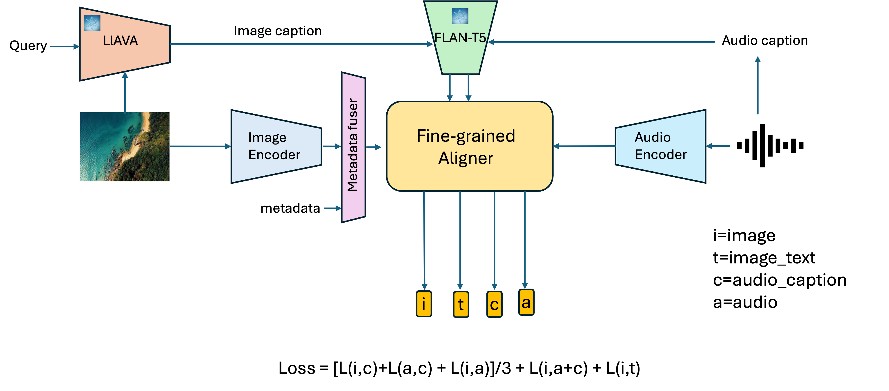

# Sat2Sound: A Unified Framework for Zero-Shot Soundscape Mapping

<p align="center">
  
</p>

<p align="center">
  <a href="https://arxiv.org/abs/2505.13777"></a>
  &nbsp;
  <a href="https://arxiv.org/pdf/2505.13777"></a>
  &nbsp;
  <a href="https://huggingface.co/MVRL/sat2sound"></a>
  &nbsp;
  <a href="https://huggingface.co/datasets/MVRL/GeoSound"></a>
  &nbsp;
  <a href="https://huggingface.co/datasets/MVRL/SoundingEarth"></a>
</p>

<p align="center">
  <a href="https://subash-khanal.github.io/">Subash Khanal</a>,
  <a href="https://vishu26.github.io/">Srikumar Sastry</a>,
  <a href="https://sites.wustl.edu/aayush/">Aayush Dhakal</a>,
  <a href="https://adeelpu.github.io/">Adeel Ahmad</a>,
  <a href="https://cs.slu.edu/~stylianou/">Abby Stylianou</a>,
  <a href="https://jacobsn.github.io/">Nathan Jacobs</a>
</p>

<p align="center">
  <b>EarthVision 2026</b> &nbsp;·&nbsp; IEEE/ISPRS Workshop on Large Scale Computer Vision for Remote Sensing
</p>

---

Sat2Sound is a trimodal (satellite image ↔ audio ↔ text) contrastive learning framework with a shared multimodal codebook. It learns a joint embedding space that enables zero-shot soundscape mapping — predicting what a location sounds like directly from satellite imagery, with optional metadata such as location and time.

## Install

```bash
conda env create -f environment.yml
conda activate sat2sound
```

## Datasets

|  | Contents |
|---|---|
| [`MVRL/GeoSound`](https://huggingface.co/datasets/MVRL/GeoSound) | Bing + Sentinel imagery, audio, precomputed mel features, LLaVA captions, metadata |
| [`MVRL/SoundingEarth`](https://huggingface.co/datasets/MVRL/SoundingEarth) | GoogleEarth imagery, audio, precomputed mel features, LLaVA captions, metadata |

Raw 32 kHz `audio` is included in both datasets. Training and evaluation use precomputed mel stacks (`mel_features`); see `data_prep/audio_feats_mgaclap.py` for extraction details.

## Evaluate

Streams data from HuggingFace — no download needed. Checkpoints auto-download from [`MVRL/sat2sound`](https://huggingface.co/MVRL/sat2sound).

```bash
bash eval_main.sh                    # image-to-audio retrieval, all 6 models
bash eval_main.sh bingmap_withmeta   # single evaluation

bash eval_i2t.sh                     # image-to-text retrieval, all 3 models
bash eval_i2t.sh bingmap_withmeta    # single evaluation
```

## Train

**Prerequisites (once):**
```bash
export SAT2SOUND_LOCAL_DATA=/mnt/big/sat2sound_local
python scripts/download_for_training.py   # downloads datasets + backbone weights
```

```bash
python -m src.train --config configs/sat2sound/bingmap_withmeta.yaml   # single experiment
bash launch_exprs.sh                                                     # all 6 models + sat2text baseline
```

Training configs: `configs/sat2sound/` (6 experiments) and `configs/sat2text/`.

## Quick-start: computing embeddings

```python
import torch
import torchaudio
from src.engine import l2normalize
from utilities.utils import load_sat2sound, encode_text, encode_gps_time, load_audio_mel, prepare_batch

device = torch.device("cuda" if torch.cuda.is_available() else "cpu")
B = 4

model, tokenizer = load_sat2sound("bingmap_withmeta", device)

# audio — swap the next two lines to use a real recording instead of white noise
torchaudio.save("/tmp/demo.wav", torch.randn(1, 320_000), sample_rate=32_000)
mel = load_audio_mel("/tmp/demo.wav", device)                  # (1, 1001, 64)

latlong, time_enc, month_enc = encode_gps_time(37.77, -122.42, hour=13, month=5, B=B, device=device)

batch = prepare_batch(
    sat           = torch.randn(B, 3, 224, 224, device=device),  # ImageNet-normalised satellite tile
    audio_mel     = mel,
    audio_caption = encode_text(["Traffic noise and distant birds."] * B, tokenizer, device),
    image_caption = encode_text(["From the aerial view of the location captured in the image, we can expect to hear car horns and people talking."] * B, tokenizer, device),
    latlong=latlong, time_enc=time_enc, month_enc=month_enc,
)

with torch.no_grad():
    embeds = model.get_embeds(batch)

sat_emb   = l2normalize(embeds["sat_embeds_dict"]["ctotal"])  # (B, 1024)
audio_emb = l2normalize(embeds["audio_embeds"])               # (B, 1024)
text_emb  = l2normalize(embeds["fdt_txt_embeds"])             # (B, 1024)

print(sat_emb @ audio_emb.T)   # (B, B) satellite ↔ audio cosine similarity
```

> For `*_nometa` checkpoints omit `latlong`, `time_enc`, and `month_enc` (they default to `None`).

## Demos

Satellite tiles from **ESRI World Imagery** — no API key needed.

```bash
export SAT2SOUND_GALLERY=$(python -c "from src.hub import resolve_hf_ckpt; print(resolve_hf_ckpt('demo/GeoSound_gallery_w_bingmap.h5'))")
python -m demos.sat2sound_retrieval   # click location → retrieve synthetic soundscape
```

See [`demos/README.md`](demos/README.md).

## Checkpoints

All checkpoints and backbone weights live at [`MVRL/sat2sound`](https://huggingface.co/MVRL/sat2sound) and are auto-downloaded via `src/hub.py:resolve_hf_ckpt`.

| Path in repo | |
|---|---|
| `sat2sound/{bingmap,sentinel,SoundingEarth}_{nometa,withmeta}.ckpt` | Trained checkpoints (6) |
| `sat2text/bingmap_i2t_baseline.ckpt` | Sat2Text baseline |
| `backbones/pretrain-vit-base-e199.pth` | SatMAE backbone |
| `backbones/mga-clap.pt` | MGACLAP backbone |
| `demo/GeoSound_gallery_w_bingmap.h5` | Retrieval demo gallery |

## Citation

```bibtex
@inproceedings{khanal2026sat2sound,
  title     = {{Sat2Sound}: A Unified Framework for Zero-Shot Soundscape Mapping},
  author    = {Khanal, Subash and Sastry, Srikumar and Dhakal, Aayush and
               Ahmad, Adeel and Stylianou, Abby and Jacobs, Nathan},
  booktitle = {IEEE/ISPRS Workshop: Large Scale Computer Vision for
               Remote Sensing (EarthVision)},
  year      = {2026},
}
```

## License

See `LICENSE`.
